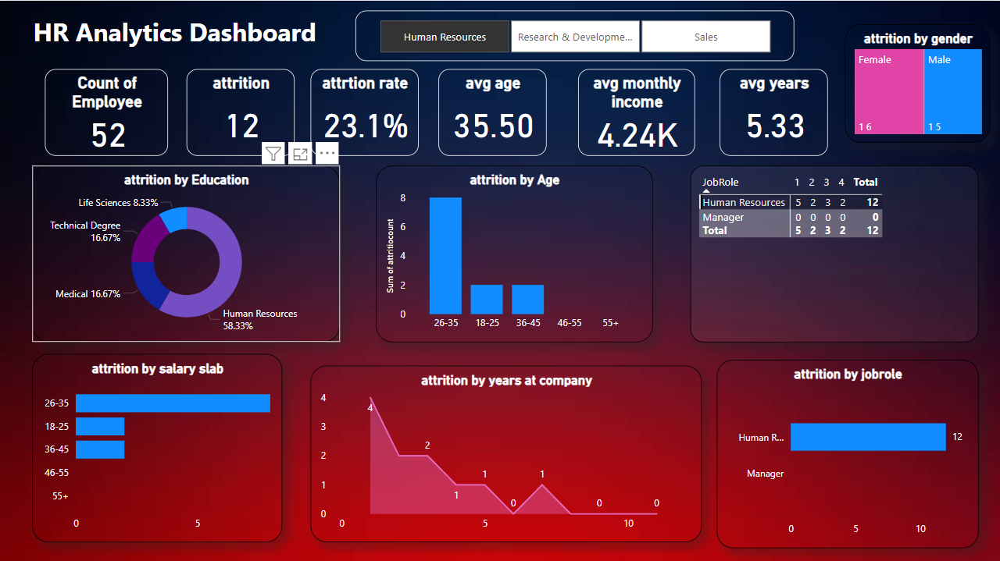
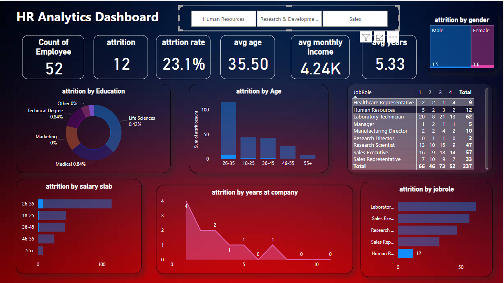
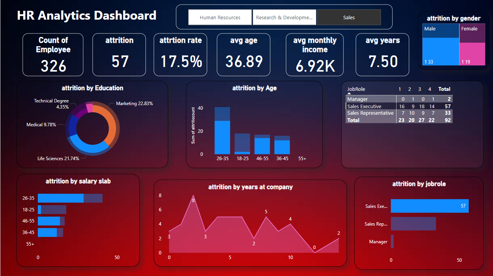

# HR Analytics using Power BI

This project provides a comprehensive analysis of HR data to help organizations understand employee trends, reduce attrition, and make informed workforce decisions. The dashboards analyze key HR metrics such as attrition by age, years of employment, salary slabs, and more.

## Features
- **Attrition Analysis**: 
  - Insights into employee turnover, categorized by age, years of employment, salary slabs, and departments.
- **Employee Demographics**: 
  - Visualizations of gender distribution, age groups, and departmental composition.
- **Salary Insights**: 
  - Analysis of salary distribution across roles, departments, and experience levels.
- **Years of Employment Analysis**:
  - Trends showing employee tenure and its correlation with attrition rates.
- **Custom Filters**:
  - Interactive slicers and filters for in-depth analysis by department, age, salary range, and other dimensions.

## Technologies Used
- **Power BI**: For data visualization and creating interactive dashboards.
- **Data Sources**: Sample HR datasets (provided in CSV/Excel format).
- **Power Query**: For cleaning and transforming raw data.
- **DAX (Data Analysis Expressions)**: For advanced calculations and creating measures.

## Key Dashboards
1. **Attrition Overview**:
   - Visualizes attrition rates by age, years of employment, and salary slabs.
   - Highlights departments and roles with the highest turnover.
2. **Employee Demographics**:
   - Breakdown of employees by age group, gender, and department.
3. **Salary Distribution**:
   - Insights into salary ranges and their impact on attrition.
4. **Employment Tenure**:
   - Analysis of employee retention trends based on years of service.

### Sample Dashboard Screenshots

#### Human Resources Overview  
  

#### R&D Overview  
  

#### Sales Overview  
  


## Project Goals
- Identify key drivers of employee attrition.
- Enable HR teams to address retention challenges.
- Provide insights into optimizing salary structures and workforce planning.

## Prerequisites
1. **Power BI Desktop**: Download from [Microsoft's official site](https://powerbi.microsoft.com/desktop/).
2. **HR Dataset**: Use the sample dataset provided or connect your own HR data.

## Installation and Setup
1. Clone the repository:
   ```bash
   git clone https://github.com/jatinAB/HR-Analytics-using-Power-BI.git
